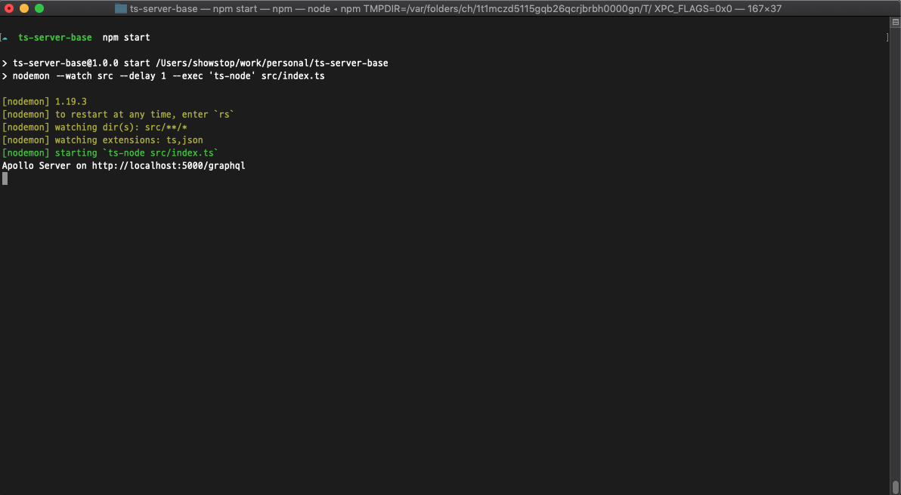
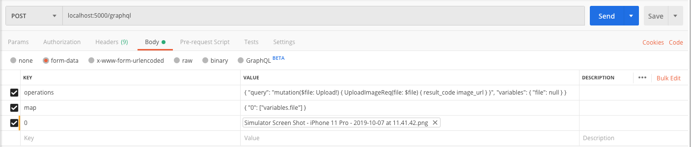
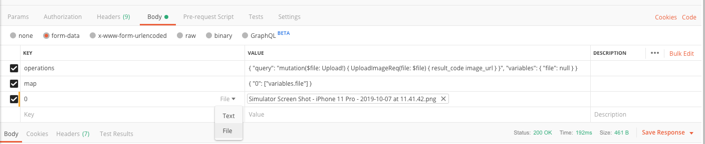
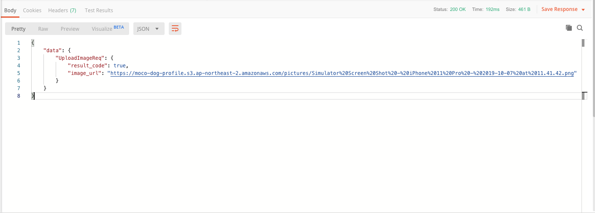

# Upload files to S3 using GraphQL

This is a example server for upload files to S3 using GraphQL.

## Edit code before test.

* You can test after write your AWS access key and secret in below code.

```javascript
    Mutation: {
        UploadImageReq: async(parent: any, args: any, context: any, info: any) => {
            const { filename, mimetype, encoding, createReadStream } = await args.file;
            const { variable, me } = context;

            let result = {
                result_code: true,
                image_url: ''
            }

            const s3 = new AWS.S3({
                accessKeyId: 'YOUR ACCESS KEY',
                secretAccessKey: 'YOUR SECRET KEY',
                region: 'ap-northeast-2',
            });

            let params = {
                'Bucket': 'YOUR_BUCKET_NAME',
                'Key': 'YOUR_S3_KEY/' + filename,
                'ACL': 'public-read',
                'Body': createReadStream(),
                'ContentType': mimetype
            };
            try {
                let upload_result = await s3.upload(params).promise();
                console.log(upload_result);
                result['image_url'] = upload_result['Location'];
            }
            catch(e) {
                console.log(e);
                result['result_code'] = false;
            }

            return result;
        },
    }
```

  ## Test using Postman.
  
  1. Launch exampe server
  
  <code>
   npm i
   npm start 
  </code>
  
  
  
  2. You can set 2 keys and values likes below.
   <pre>
   operations: { "query": "mutation($file: Upload!) { UploadImageReq(file: $file) { result_code image_url } }", "variables": { "file": null } }
   
   map: { "0": ["variables.file"] }
   
   </pre>
  
  
  
  3. Finally, you can change to file type of '0' key and select your image on your PC.
  
  
  
  4. You can see the result likes below after send this message to server.
  
  
  
 

  
  
